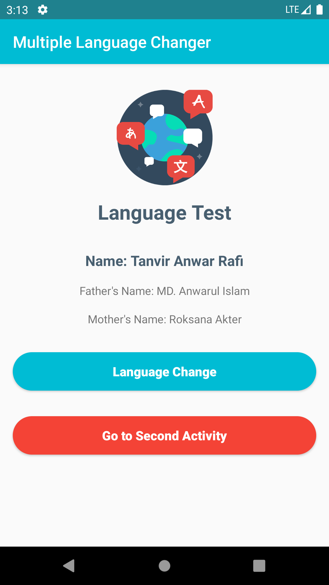
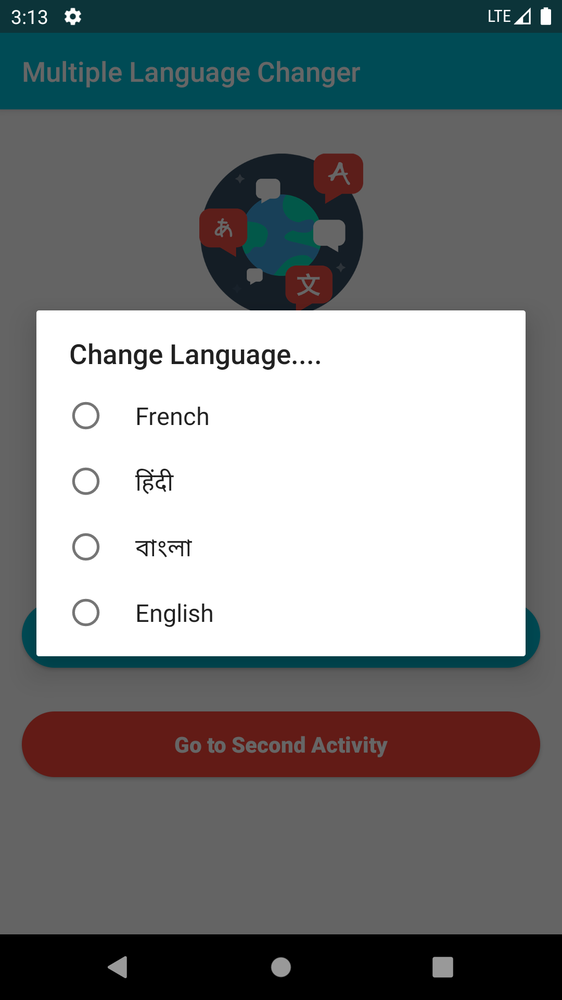
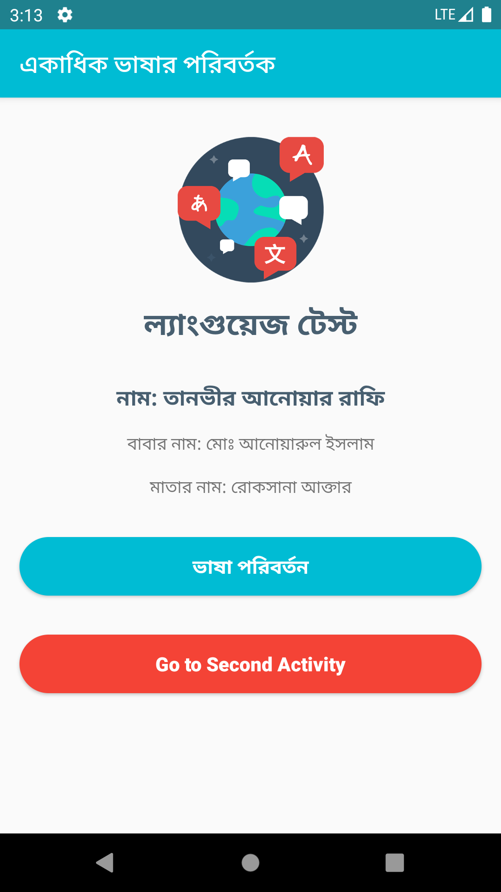
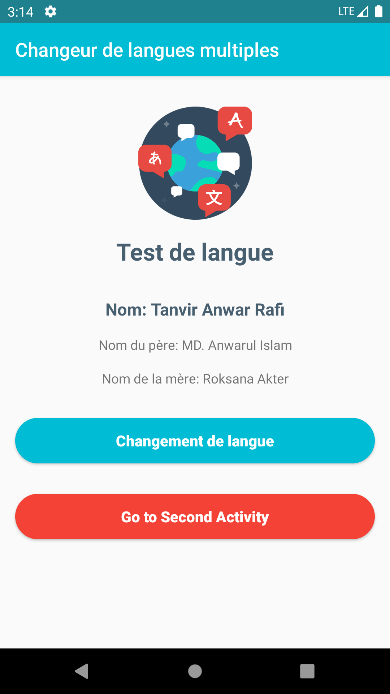
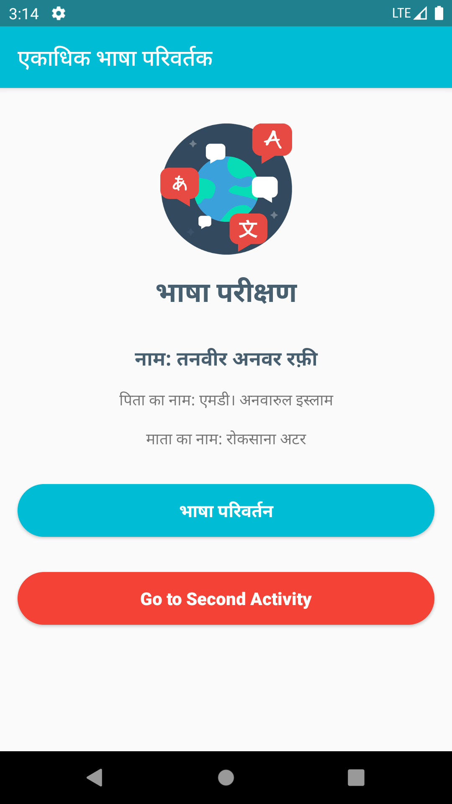
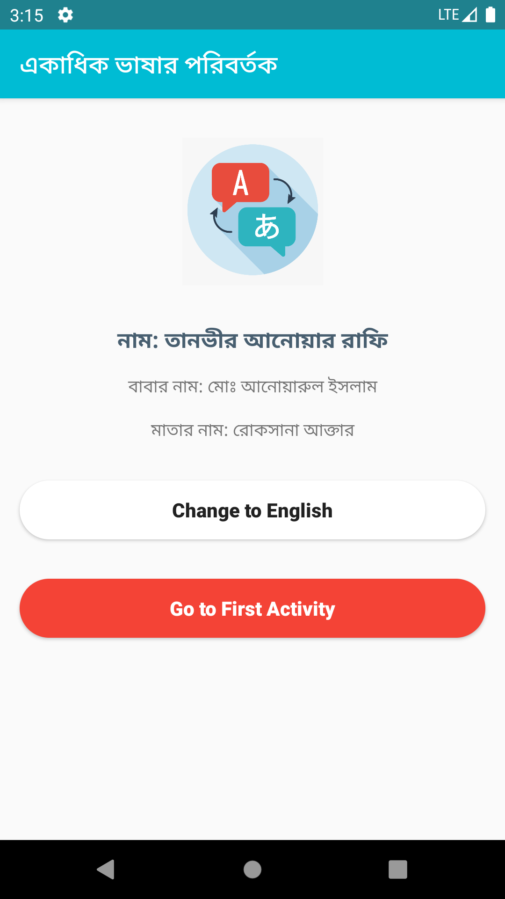
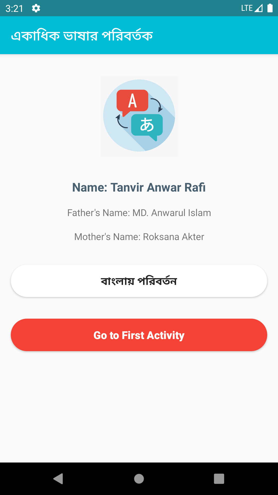

# Localization

This project is for learning multiple language change feature in Android App Development.

### - Multiple Language Change

### Screenshots

 &nbsp;&nbsp;&nbsp;  &nbsp;&nbsp;&nbsp;  &nbsp;&nbsp;&nbsp;   

 &nbsp;&nbsp;  &nbsp;&nbsp;  
